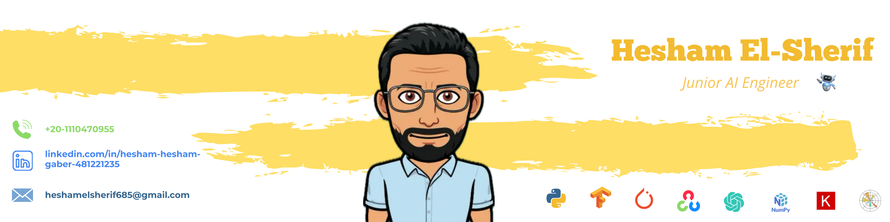

<h2> Hi there 👋🏻 </h2>

   

<d>I'm Hesham El-Sherif experienced computer engineer specializing in Machine Learning and deep learning. Proficient in TensorFlow, PyTorch, Numpy, OpenCV, and Matplotlib. My GitHub showcases a diverse range of projects, from innovative deep learning models to practical applications in computer vision and natural language processing. Strong focus on clean code, documentation, and reproducibility. </d>

----------------
<h2>💻 I'm  currently Learning </h2>
<ul>
    <li>Generative AI
    <li>Transformers 
    <li> Deep Reinforcement Learning 
</ul>

----
<h2>🧑🏻‍💻 Programing language </h2>
<ul>
    <li>Python
    <li>kotlin
    <li>C/C++
    <li>Java
    <li>HTML/CSS
    <li>PHP
</ul>

____
<h2>🤖 Libraries</h2>
<ul>
    <li>Tensorflow
    <li>Pytorch
    <li>OpenCV
    <li>Numpy
    <li>Keras
    <li>Matplotlib
    <li>OpenAi
</ul>

-----
<h2>👀 Stars </h2>

-------

<h2>📬 How to reach me:</h2>

  

